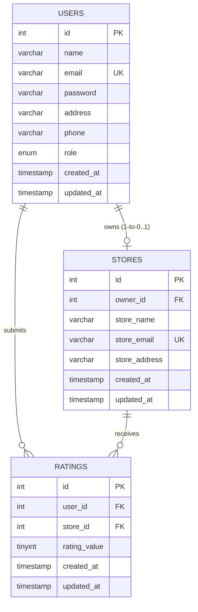

# Store Management System - Backend Documentation Overview

Welcome to the backend documentation for the **Store Management System**. This backend is built using **Node.js** with the **Express.js** framework and is backed by a **MySQL** database. It provides API services for user registration, authentication, store profile management, and store ratings/reviews.

---

## 🚀 Tech Stack & Core Libraries

- **Runtime Environment:** Node.js (v16+)
- **Web Framework:** Express.js (v5.2.1)
- **Database Driver:** mysql2 (v3.22.4) — utilizing a connection pool for query execution.
- **Security & Cryptography:** 
  - `bcrypt` (v6.0.0) — for secure password hashing and verification.
  - `jsonwebtoken` (v9.0.3) — for issuing stateless JSON Web Tokens on user authentication.
- **File Upload Handler:** `multer` (v2.1.1) (configured in store routes for future attachments).
- **CORS Support:** `cors` (v2.8.6) — enabled globally to allow cross-origin requests from the React frontend.

---

## 📂 Backend Directory Structure

```
Backend/
├── routes/                  # Express Router files defining endpoint paths
│   ├── admin.js             # Admin statistics and management routes
│   ├── ratings.js           # Review and rating endpoints (CRUD)
│   ├── store.js             # Store profile setup, updates, and searches
│   ├── store_owner.js       # Store owner dashboard statistics and ratings
│   └── user.js              # Normal user registration, login, and password updates
│
├── utils/                   # Shared helpers and utility modules
│   ├── authuser.js          # JWT Verification middleware (available for routing)
│   ├── config.js            # Configuration constants (bcrypt salt, JWT secrets)
│   ├── db.js                # MySQL database connection pool configuration
│   └── result.js            # Unified JSON response formatter helper
│
├── package.json             # Project dependency registry and npm scripts
├── seed.js                  # Database seeder utility to populate test data
├── server.js                # Entry point of the Express application
└── store.sql                # SQL script containing database creation and schemas
```

---

## 🗄️ Database Schema & Configuration

The application uses a relational schema with three primary tables: `users`, `stores`, and `ratings`.



### Table Details & Constraints
1. **`users` Table:**
   - Stores accounts for all three roles: `Normal` (default), `Store Owner`, and `Admin`.
   - Has constraint limits applied: `name` (max 60 chars), `email` (must be unique), `address` (max 400 chars).
2. **`stores` Table:**
   - Linked to `users` via `owner_id` (foreign key constraint with `ON DELETE CASCADE`).
   - Store owners can only set up one store profile from their dashboard post-login.
   - `store_email` has a `UNIQUE` constraint.
3. **`ratings` Table:**
   - Tracks ratings (1 to 5 stars) given to stores by users.
   - Restricts duplicate submissions using a `UNIQUE KEY unique_user_store_rating (user_id, store_id)` constraint (one user can rate a store only once).
   - Rating values are validated via the database constraint: `CHECK (rating_value BETWEEN 1 AND 5)`.

> [!NOTE]
> Database setup instructions and credentials are described in the [Implementation Guide](IMPLEMENTATION_GUIDE.md).

---

## 👤 User Roles & Feature Matrix

The backend supports role-based access control, exposing specific metrics and functionalities tailored to each role:

| Feature / Action | Admin | Store Owner | Normal User | Root Path |
| :--- | :---: | :---: | :---: | :--- |
| **User Sign Up / Registration** | `POST /admins/register` | `POST /store-owners/register` | `POST /users/register` | Guest Accessible |
| **User Authentication / Login** | `POST /admins/login` | `POST /store-owners/login` | `POST /users/login` | Guest Accessible |
| **Change/Update Password** | *Available* | `PUT /store-owners/update-password` | `PUT /users/update-password` | Account Protected |
| **Create Store Profile** | ✗ | `POST /stores/add` | ✗ | Owner dashboard |
| **Update Store Profile** | ✗ | `PUT /stores/update/:id` | ✗ | Owner dashboard |
| **Delete Store Profile** | ✗ | `DELETE /stores/delete/:id` | ✗ | Owner dashboard |
| **Retrieve All Stores** | `GET /admins/stores/all` | `GET /stores/all` | `GET /stores/all-with-user-ratings` | Authorized |
| **Submit / Edit Store Ratings** | ✗ | ✗ | `POST /ratings/add` / `PUT /ratings/update/:id` | Normal User |
| **View Store Ratings / Reviews** | ✗ | `GET /store-owners/ratings` | `GET /ratings/store/:store_id` | Authorized |
| **View Dashboard Statistics** | `GET /admins/*` (multi-count) | `GET /store-owners/ratings/average` | ✗ | Dashboard View |

---

## 🔑 Default Test Credentials

During development and local verification, you can run the seeder script (`npm run seed`) to register the following pre-configured test users:

- **Admin Account:**
  - **Email:** `admin@example.com`
  - **Password:** `AdminPassword123!`
- **Store Owner Account:**
  - **Email:** `owner.one.[timestamp]@example.com` (e.g. `owner.one.40180@example.com`)
  - **Password:** `OwnerPass123!`
- **Normal User Account:**
  - **Email:** `alice.seed.[timestamp]@example.com` (e.g. `alice.seed.40180@example.com`)
  - **Password:** `Password123!`

---

## 🛠️ Local Setup Quick Start

To launch and seed the backend locally, execute the following steps in your terminal:

```powershell
# 1. Navigate to the backend directory
cd d:/Store_Management/Backend

# 2. Install dependencies
npm install

# 3. Ensure your MySQL Server is running and import the database schema
mysql -u root -p -e "CREATE DATABASE IF NOT EXISTS store;"
mysql -u root -p store < ../store.sql

# 4. Run the seeder script to populate mockup users, stores, and ratings
npm run seed

# 5. Start the Node.js server
node server.js
```

> [!TIP]
> The backend server runs by default on port `4000` (`http://localhost:4000`). All client requests from the frontend should target this port.

---

## 📚 Related Documentation Files

For in-depth details on different aspects of the backend, consult the following guides:
1. [API Endpoints Reference](API_ENDPOINTS.md) — Comprehensive listing of all endpoint payloads, methods, and parameters.
2. [Authentication & Authorization Guide](AUTH_AUTHORIZATION_GUIDE.md) — Detailed breakdown of bcrypt password hashing, token signatures, and role-based permissions.
3. [Implementation Guide](IMPLEMENTATION_GUIDE.md) — Steps for setting up the MySQL connection pool, environment configuration, and backend development rules.
