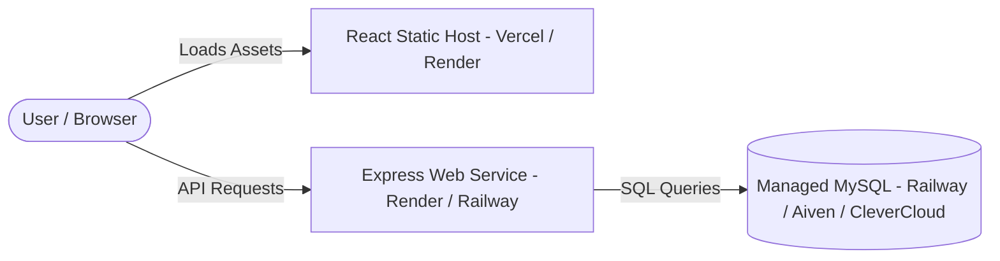

# Store Management System - Full Deployment Guide (GitHub to Production)

This guide walks you through deploying the entire **Store Management System** (React frontend + Express backend + MySQL database) to the cloud using **GitHub** and popular free-tier-friendly hosting services like **Render**, **Railway**, or **Vercel**.

---

## 🏗️ Deployment Architecture



---

## 🛠️ Step 1: Prepare Your Project & Push to GitHub

Before deploying, make sure your code does not contain hardcoded passwords or lock local port bindings. 

### 1. Verification Checklist
- [x] **Backend DB Connections:** `Backend/utils/db.js` uses `process.env` properties.
- [x] **Backend Server Binding:** `Backend/server.js` listens to `process.env.PORT` and binds to host `0.0.0.0` (required for cloud container routing).
- [x] **Frontend API Base URL:** `Frontend/Storewebv1/src/api.js` points to `import.meta.env.VITE_API_BASE_URL`.
- [x] **Gitignore Setup:** Verify you have a `.gitignore` in the root (or in both folders) preventing folders like `node_modules`, `.env`, and build outputs (`dist`) from being uploaded to GitHub.

### 2. Push Your Project to GitHub
Open a terminal in the root project directory (`d:/Store_Management`) and execute:

```bash
# Initialize git repository
git init

# Add all files to staging (ignoring files specified in .gitignore)
git add .

# Create your initial commit
git commit -m "feat: ready for production cloud deployment"

# Link your local repo to your GitHub repository
git remote add origin https://github.com/YOUR_USERNAME/YOUR_REPO_NAME.git

# Rename primary branch to main
git branch -M main

# Push code to GitHub
git push -u origin main
```

---

## 🗄️ Step 2: Provision a Managed MySQL Database

To run your production server, you need a hosted MySQL database instance.

### Option A: Railway MySQL (Recommended - Fast & Simple)
1. Log in to [Railway.app](https://railway.app) using your GitHub account.
2. Click **New Project** -> **Provision MySQL**.
3. Railway will provision a container running MySQL.
4. Click on the **MySQL** card, navigate to the **Variables** tab, and copy the connection credentials:
   - `MYSQLHOST` (Maps to `DB_HOST`)
   - `MYSQLUSER` (Maps to `DB_USER`)
   - `MYSQLPASSWORD` (Maps to `DB_PASSWORD`)
   - `MYSQLDATABASE` (Maps to `DB_NAME`)
   - `MYSQLPORT` (Maps to `DB_PORT`)

### Option B: Aiven / Clever Cloud (Free-Tier MySQL Database)
1. Sign up for a free MySQL database on [Aiven](https://aiven.io) or [Clever Cloud](https://www.clever-cloud.com).
2. Choose MySQL as the database type.
3. Once the database is ready, copy the connection host, database name, user, password, and port (usually `3306`).

### ⚡ Import Database Schema
Once your database is created, you must import the table schemas:
1. Connect to your database using a local manager (e.g. MySQL Workbench, DBeaver, or command line).
2. Open the [store.sql](file:///d:/Store_Management/store.sql) file.
3. Execute the SQL queries (excluding the local `CREATE DATABASE store; USE store;` statements if your host pre-allocated a custom database name for you) to create the `users`, `stores`, and `ratings` tables.

---

## ⚙️ Step 3: Deploy the Express Backend API

We will deploy the Node.js backend using **Render** or **Railway**.

### Option A: Deploy Backend on Render (Free Web Service)
1. Sign in to the [Render Dashboard](https://dashboard.render.com).
2. Click **New** -> **Web Service**.
3. Connect your GitHub account and select your repository.
4. Configure the following settings:
   - **Name:** `store-management-api`
   - **Environment:** `Node`
   - **Region:** Choose the region closest to you.
   - **Branch:** `main`
   - **Root Directory:** `Backend` *(This makes Render build from the Backend folder)*
   - **Build Command:** `npm install`
   - **Start Command:** `node server.js`
   - **Instance Type:** `Free`
5. Click **Advanced** and add the following **Environment Variables**:
   - `DB_HOST` = (Your hosted MySQL host address)
   - `DB_USER` = (Your hosted MySQL username)
   - `DB_PASSWORD` = (Your hosted MySQL password)
   - `DB_NAME` = (Your hosted MySQL database name)
   - `DB_PORT` = `3306`
   - `JWT_SECRET` = (A secure random alphanumeric string, e.g. `MyProdJwtSecretKey123!`)
   - `SALT_ROUND` = `10`
6. Click **Create Web Service**. Render will download, build, and deploy your Express backend.
7. Once successfully deployed, copy the Render service URL (e.g., `https://store-management-api.onrender.com`).

---

## 💻 Step 4: Deploy the React Frontend (Vite)

We will deploy the static React files on **Vercel** or **Render Static Site**.

### Option A: Deploy Frontend on Vercel (Easiest)
1. Sign in to the [Vercel Dashboard](https://vercel.com).
2. Click **Add New** -> **Project**.
3. Select your GitHub repository.
4. Configure the project parameters:
   - **Framework Preset:** `Vite`
   - **Root Directory:** `Frontend/Storewebv1` *(Vercel will build inside this subfolder)*
   - **Build Command:** `npm run build`
   - **Output Directory:** `dist`
5. Expand **Environment Variables** and add the API endpoint variable:
   - **Key:** `VITE_API_BASE_URL`
   - **Value:** `https://store-management-api.onrender.com` *(Paste your deployed backend URL from Step 3)*
6. Click **Deploy**. Vercel will build the frontend assets, bundle the assets, and publish your live app link.

### Option B: Deploy Frontend on Render (Static Site)
1. On the Render dashboard, click **New** -> **Static Site**.
2. Select your repository.
3. Configure settings:
   - **Name:** `store-center-client`
   - **Root Directory:** `Frontend/Storewebv1`
   - **Build Command:** `npm run build`
   - **Publish Directory:** `dist`
4. Add the environment variable:
   - `VITE_API_BASE_URL` = `https://store-management-api.onrender.com` *(Your deployed backend URL)*
5. Click **Create Static Site**.

---

## 🔍 Step 5: Test the Live Application

1. Open your deployed React frontend URL (e.g., `https://store-center-client.vercel.app` or `https://store-center-client.onrender.com`).
2. Register a new user, log in, browse the store list, and submit a rating.
3. Open your browser dev tools console (F12) to verify all API requests are routing correctly to your secure cloud API without CORS issues.

---

> [!TIP]
> If you deploy the backend on Render's **Free Tier**, the server will spin down (sleep) after 15 minutes of inactivity. The first request after a sleep period might take 30-50 seconds to respond as the instance spins back up. For production setups, consider upgrading the web service to a basic paid tier to keep the server hot 24/7.
