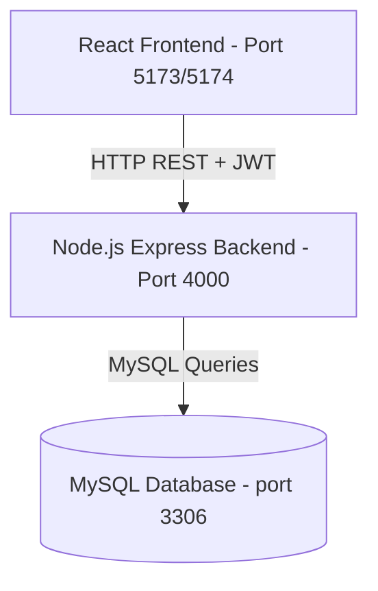

# StoreCenter - Store Management System

StoreCenter is a premium, commercial-grade web application designed to manage stores and aggregate customer reviews and ratings. It features a modern, responsive user interface styled in a high-contrast **Vibrant Orange and Pitch Black** theme, backed by a robust REST API and a MySQL database.

The application implements a single login system supporting three distinct roles: **System Administrator**, **Store Owner**, and **Normal User (Customer)**, each with custom workflows and dashboards.

---

## Technical Architecture Overview

StoreCenter uses a decoupled client-server architecture:



---

## Tech Stacks

### Backend (`/Backend`)
- **Runtime**: Node.js
- **Framework**: Express.js
- **Database Driver**: `mysql2` (Connection Pooling)
- **Security**: `bcrypt` (Salt Round Hashing)
- **Session Management**: JSON Web Tokens (JWT)

### Frontend (`/Frontend/Storewebv1`)
- **Library**: React 19 (Functional components, Hooks, Context API)
- **Build Tool**: Vite 7
- **Routing**: React Router DOM v7 (Role-Based Protected Routes)
- **Styling**: Tailwind CSS v4 & PostCSS
- **Icons**: Lucide React
- **HTTP Client**: Axios (configured with request interceptors)

---

## Database Configuration

The application requires a MySQL database.

### 1. Connection Parameters
The backend connects to MySQL using the parameters defined in [db.js](file:///d:/Store_Management/Backend/utils/db.js):
- **Host**: `localhost`
- **User**: `root`
- **Password**: `manager`
- **Database Name**: `store`

### 2. Schema Structure
Ensure the `store` database contains the following tables (refer to [store.sql](file:///d:/Store_Management/store.sql) for details):

- **`users` Table**:
  - `id` (INT, Primary Key, Auto Increment)
  - `name` (VARCHAR, 20-60 characters constraint)
  - `email` (VARCHAR, Unique)
  - `password` (VARCHAR, Hashed)
  - `address` (VARCHAR, Max 400 characters)
  - `phone` (VARCHAR)
  - `role` (ENUM: `'Normal'`, `'Store Owner'`, `'Admin'`)
- **`stores` Table**:
  - `id` (INT, Primary Key, Auto Increment)
  - `owner_id` (INT, Foreign Key mapping to `users.id`)
  - `store_name` (VARCHAR)
  - `store_email` (VARCHAR)
  - `store_address` (VARCHAR, Max 400 characters)
- **`ratings` Table**:
  - `id` (INT, Primary Key, Auto Increment)
  - `user_id` (INT, Foreign Key mapping to `users.id`)
  - `store_id` (INT, Foreign Key mapping to `stores.id`)
  - `rating_value` (INT, CHECK constraint 1 to 5)
  - `created_at` (TIMESTAMP, Default CURRENT_TIMESTAMP)

---

## Role Workflows

### 1. System Administrator
- Displays platform statistics: Total Users, Total Stores, and Total Ratings.
- Adds new users (Administrators, Store Owners, Normal Users) with strict field-length and password strength validations.
- Registers new store profiles and maps them to registered Store Owners.
- Searches, filters, and sorts dynamic user registries and store directories.

### 2. Store Owner
- If no store profile is assigned, the dashboard displays a setup card allowing owners to register their store.
- Displays the store's overall average rating (out of 5.0) and total reviews.
- Renders a sortable table detailing all customer reviews: User Name, Email, Submitted Rating, and Submission Date.
- Includes a validated password change panel.

### 3. Normal User (Customer)
- Self-registers via the **Create Account** page.
- Browses and searches all registered stores on the platform by name or address, sortable by Name or Average Rating.
- Clicking a store card opens a **Yelp-style Details Modal**:
  - Displays a visual **Rating Breakdown** chart of percentages for 5, 4, 3, 2, and 1 star scores.
  - Displays a scrollable timeline of recent customer reviews.
  - Houses the interactive 1-5 star selection widget to submit new ratings or modify existing ones.
- Includes a validated password change panel.

---

## Setup & Execution Guide

### 1. Database Setup
Make sure your MySQL server is running and create the `store` schema:
```sql
CREATE DATABASE store;
USE store;
-- Import the schema from store.sql
```

### 2. Run the Backend Server
Navigate to the `/Backend` directory, install dependencies, seed dummy database rows, and start the API:
```bash
# Move to Backend folder
cd Backend

# Install dependencies
npm install

# Seed data (Users, Store Owners, Stores, Ratings)
npm run seed

# Start the Express server
node server.js
```
The backend server runs on **port 4000**.

### 3. Run the Frontend Client
Navigate to the `/Frontend/Storewebv1` directory, install dependencies, and start the Vite development server:
```bash
# Move to Frontend project
cd Frontend/Storewebv1

# Install frontend dependencies
npm install

# Launch dev server
npm run dev
```
The frontend is hosted on **`http://localhost:5173`** (or `http://localhost:5174` if port 5173 is occupied).

---

## Test Credentials

We seeded the database with default accounts you can use to test each role's dashboard:

### 1. System Administrator
- **Email**: `admin@example.com`
- **Password**: `AdminPassword123!`

### 2. Store Owner
- **Email**: `owner.one.40180@example.com`
- **Password**: `OwnerPass123!`

### 3. Normal User (Customer)
- **Email**: `alice.seed.40180@example.com`
- **Password**: `Password123!`
